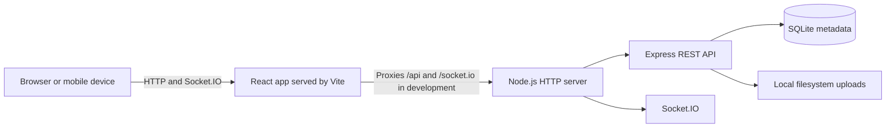
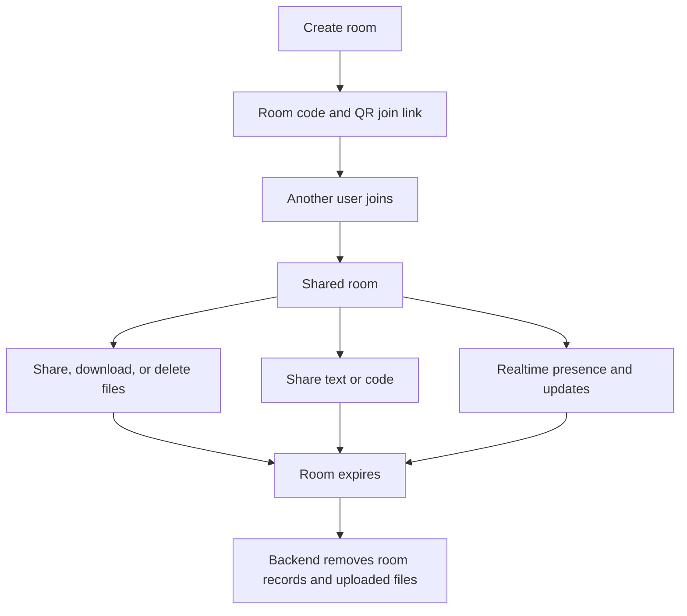

# OfficeBridge

**Temporary room-based file sharing for devices on the same network.**

Sharing ZIP files, documents, images, videos, source code, and other files between an office computer and a mobile device can be inconvenient when common consumer file-sharing services are unavailable or restricted. OfficeBridge creates temporary rooms where multiple users can join and share files and text in real time.

> **Current status: MVP.** OfficeBridge is intended for local and trusted-network use. It currently uses SQLite and local filesystem storage. HTTPS is not implemented.

## Features

- Create temporary rooms with a random 8-character room code
- Join a room by entering its code or scanning a QR code
- See connected users and room activity update in real time
- Drag and drop or browse to upload files
- Download and delete shared files
- Share text and code snippets, with an optional language label
- Automatically expire rooms and remove their database records and uploaded files
- Responsive interface for desktop and mobile screens

## How it works

The room creator gets a room code and QR join link. Other users join with a display name. Room members can then share files and text; Socket.IO sends live presence and content updates. Rooms expire after their configured duration, and the backend periodically removes expired room records and associated uploads.



The current Docker Compose setup runs the backend only. The frontend is started separately with Vite.

## User flow



## Screenshots

Screenshots are not included in the repository yet.

## Architecture

- **Frontend:** React application built and served in development by Vite. Vite proxies API and Socket.IO traffic to the backend during local development.
- **Backend:** One Node.js HTTP server hosts Express REST routes and Socket.IO.
- **Metadata:** SQLite stores rooms, temporary users, file metadata, and shared text.
- **Uploads:** File contents are written to the local `storage/` directory under generated names.
- **Expiry:** The backend checks room expiration on room-scoped requests and runs cleanup at startup and once per minute.
- **Deployment:** Docker Compose builds and runs the backend with bind-mounted `data/` and `storage/` directories. It does not build or serve the frontend.

## Tech stack

| Area | Technologies |
| --- | --- |
| Frontend | React, Vite, Socket.IO Client |
| Backend | Node.js, Express, Socket.IO, SQLite (`node:sqlite`), Multer |
| QR codes | `qrcode` |
| Deployment | Docker, Docker Compose |

## Project structure

```text
OfficeBridge/
├── backend/
│   ├── src/server.js
│   ├── test/smoke.js
│   ├── .env.example
│   ├── Dockerfile
│   ├── package.json
│   └── package-lock.json
├── frontend/
│   ├── src/
│   │   ├── App.jsx
│   │   ├── main.jsx
│   │   └── styles.css
│   ├── test/e2e.js
│   ├── index.html
│   ├── vite.config.js
│   ├── package.json
│   ├── package-lock.json
│   └── .gitkeep
├── data/
│   └── .gitkeep
├── storage/
│   └── .gitkeep
├── docker-compose.yml
├── .gitignore
└── README.md
```

Runtime SQLite files, uploaded file contents, dependencies, and build output are excluded from version control. The `.gitkeep` files preserve the empty runtime directories in a fresh checkout.

## Getting started

### Requirements

- Node.js **22.13 or later** (the backend uses the built-in `node:sqlite` module)
- npm
- Docker and Docker Compose only if using the Docker option

### Environment variables

The backend loads `backend/.env` when started locally. Copy the provided example before editing values:

PowerShell:

```powershell
Copy-Item backend/.env.example backend/.env
```

macOS/Linux:

```sh
cp backend/.env.example backend/.env
```

| Variable | Default | Description |
| --- | --- | --- |
| `PORT` | `3000` | Backend HTTP port |
| `DATABASE_PATH` | `../../data/officebridge.sqlite` | SQLite database path, resolved relative to the backend source directory |
| `STORAGE_PATH` | `../../storage` | Local directory for uploaded file contents, resolved relative to the backend source directory |
| `MAX_UPLOAD_SIZE` | `10485760` | Maximum size of one uploaded file, in bytes (**10 MiB**) |
| `DEFAULT_ROOM_EXPIRATION_MINUTES` | `60` | Default room lifetime; room creation can specify a duration up to 7 days |
| `VITE_API_BASE_URL` | empty | Optional frontend API base URL; leave empty for Vite's local `/api` and Socket.IO proxies |

Keep real `.env` files private. `.env.example` contains safe defaults and is intended to be committed. Docker Compose reads interpolation values from the shell or a root `.env`; its `PORT` value controls the host-side port, while the backend container listens on port 3000. The Compose file passes upload-size and default-expiration settings to the backend.

### Running locally

Open two terminal windows from the project root.

Terminal 1 — install and start the backend:

```sh
cd backend
npm ci
npm start
```

Terminal 2 — install and start the frontend:

```sh
cd frontend
npm ci
npm run dev
```

Expected local URLs:

- Frontend: <http://localhost:5173>
- Backend health check: <http://localhost:3000/health>

Vite binds to `0.0.0.0` for LAN testing. The default local browser URL is still `localhost`; to use another device on the same network, open the host computer's LAN IP at port 5173. The backend and Vite development server use plain HTTP; HTTPS/TLS is not implemented.

## Running with Docker

From the project root:

```sh
docker compose up --build
```

This builds and starts the **backend only** on host port 3000 by default. SQLite data and uploaded files are persisted through bind mounts to `./data` and `./storage`. Verify the backend at <http://localhost:3000/health>. Start the frontend separately using the Vite steps above; its development proxy expects the backend at `http://localhost:3000`.

To stop the service, press `Ctrl+C`, then run:

```sh
docker compose down
```

Runtime data in `data/` and `storage/` remains on the host and is not committed.

## API overview

The REST API is served by the backend. Room-scoped information and file/text operations require a valid room member ID in the `X-User-Id` header, except for joining. Expired rooms are rejected.

| Method | Endpoint | Purpose |
| --- | --- | --- |
| `GET` | `/health` | Backend health check |
| `POST` | `/api/rooms` | Create a room and its owner; accepts `name`, `displayName`, and optional `expirationMinutes` |
| `GET` | `/api/rooms/:code` | Get room information and member records; requires `X-User-Id` |
| `POST` | `/api/rooms/:code/join` | Join by room code; accepts `displayName` |
| `GET` | `/api/rooms/:code/files` | List room files; requires `X-User-Id` |
| `POST` | `/api/rooms/:code/files` | Upload one file in multipart field `file`; requires `X-User-Id` |
| `GET` | `/api/rooms/:code/files/:fileId` | Download a room file; requires `X-User-Id` |
| `DELETE` | `/api/rooms/:code/files/:fileId` | Delete a room file; requires `X-User-Id` |
| `GET` | `/api/rooms/:code/texts` | List shared text/code; requires `X-User-Id` |
| `POST` | `/api/rooms/:code/texts` | Share content and optional `language`; requires `X-User-Id` |

Responses and validation errors are JSON except successful file downloads and the `204 No Content` file-delete response. The maximum upload size is currently **10 MiB per file**. There is no total storage quota or room file-count limit.

## Realtime events

Socket.IO connects to the backend with `auth: { roomCode, userId }`. The server checks that the room is active and the user ID belongs to it.

| Event | Direction | Payload / meaning |
| --- | --- | --- |
| `users:present` | Server → connecting client | `{ users: [{ id, displayName }] }` for users currently connected to Socket.IO in that room |
| `user:joined` | Server → room | `{ user: { id, displayName } }` when a user joins/connects |
| `user:left` | Server → room | `{ userId }` when the user's last active socket disconnects |
| `file:uploaded` | Server → room | `{ file }` after a file is uploaded |
| `file:deleted` | Server → room | `{ fileId }` after a file is deleted |
| `text:shared` | Server → room | `{ text }` after text/code is shared |
| `room:expired` | Server → room | `{ code }` when cleanup expires a room |

Presence is held in backend process memory and reflects connected sockets; user records in SQLite alone are not considered online.

## Security considerations

Current protections include cryptographically generated room codes, server-issued temporary user IDs, room membership checks on protected routes and Socket.IO connections, generated physical upload filenames, filename sanitization, path traversal checks, the backend-enforced 10 MiB file-size limit, and expiration checks on room-scoped API routes.

OfficeBridge is an MVP and does not currently provide:

- HTTPS/TLS; HTTP and Socket.IO traffic is unencrypted in transit
- Authentication or persistent user accounts; the temporary user ID is a bearer credential
- Room or global storage quotas
- Distributed storage or multi-instance presence
- Production-grade rate limiting or broader production hardening

Use it on a trusted network. Uploaded bytes and SQLite data reside on the host's local filesystem. The implementation accepts arbitrary file types and does not provide malware scanning.

## Current limitations

- Local filesystem storage and SQLite are used; the backend is a single-process MVP.
- The per-file upload limit is 10 MiB and is configurable, but there is no total storage quota.
- HTTPS/TLS, user authentication, persistent accounts, distributed storage, and production-grade rate limiting are not implemented.
- Docker Compose runs only the backend; run the frontend separately with Vite.
- The repository currently has no screenshots and no selected software license.

## Roadmap

- [x] Temporary room creation and joining
- [x] Random room codes and QR sharing
- [x] Multi-user room presence
- [x] File upload, download, and deletion
- [x] Shared text/code
- [x] Realtime room updates
- [x] Room expiration and cleanup
- [x] Responsive UI
- [ ] Storage quotas and storage usage controls
- [ ] Review higher upload limits alongside storage controls
- [ ] HTTPS/TLS deployment
- [ ] Production hardening and monitoring
- [ ] Optional cloud/object storage
- [ ] Optional authentication

## Contributing

Issues and pull requests are welcome. For changes, please describe the problem and the behavior you verified. Run the backend smoke checks with `cd backend; npm run test:smoke` (PowerShell) or `cd backend && npm run test:smoke` (macOS/Linux). The browser end-to-end checks are available with `cd frontend; npm run test:e2e` and require Google Chrome plus a running backend and Vite server; `CHROME_PATH` can select a non-standard Chrome path.

## License

No license has been selected or included yet. Until a license is added, permissions for reuse and redistribution are not specified. Please choose a license before one is created.
